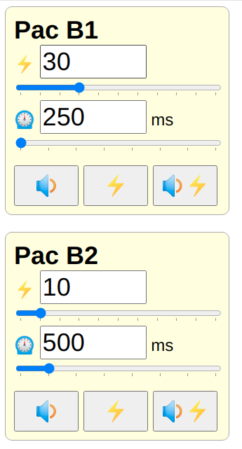

# Pyshock

Pyshock is a computer based remote control for shock collars.

It consists of
- a web-based user interface, that works on mobile
- a randomizer program
- a command line interface program.
- a web-based API

## ✔️ Requirements

- One or more PAC shock collars (Pacdog ACX or BCX collar or anything compatible with ATX or DTX remote).
- A Software Defined Radio (SDR) transmitter that works on the required frequencies (tested using a HackRF device).
- Linux with Python 3 (tested on Ubuntu 20.04)
- Universal Radio Hacker (`apt install python3-pip; pip3 install urh`).

## 🔧 Getting Started

Make sure that `urh` is working and does recognize your SDR device.

Run `./pyshockcli.py`. This command will generate a `pyshock.ini` configuration file.
Please edit this file to specify your SDR transmitting hardware.

Reset your collar into pairing mode and invoke `./pyshockcli` again.
After successful pairing, run it a third time, to issue a "beep" command.

## 🖥 Command line interface (pyshockcli)

pyshockcli allows you to send commands using the command line ("terminal window").

By default, it will send a BEEP command to the first receiver configured in `pyshock.ini`.

For example, to send a shock of 250ms duration with 10% power to the second receiver:

`./pyshockcli.py --action ZAP --duration 250 --power 10 --receiver 1`

The following actions are supported:

- **LED**:  blinks the light. Note: This might cause a tiny shock on PAC collars.
- **BEEP**: plays the beep sound
- **VIP**:  reserved for future use. Note: This will beep on PAC collars.
- **ZAP**:  a shock.
- **BEEPZAP**: plays one beep sound, waits one second, and then triggers a shock according to parameters.

~~~~
usage: pyshockcli.py [-h] [-r n] [-a {LED,BEEP,VIB,ZAP,BEEPZAP}] [-d n] [-p n] [-v] [--version]

Shock collar remote

optional arguments:
  -h, --help            show this help message and exit
  -a {LED,BEEP,VIB,ZAP,BEEPZAP}, --action {LED,BEEP,VIB,ZAP,BEEPZAP}
                        Action to perform
  -d n, --duration n    duration in ms (Note: PAC uses an impulse duration of 250ms)
  -p n, --power n       power level (0-100)
  -r n, --receiver n    index of receiver entry from pyshock.ini, starting at 0
  -v, --verbose         prints debug messages
  --version             show program's version number and exit

Please see https://github.com/pyshock/pyshock for documentation.
~~~~

## 📱 Interactive Remote Control (pyshockserver)

pyshockserver will start a web server, that will provide a user interface
as shown on the screenshot.

The webpage will work on mobile devices, provided that the mobile device
can reach the IP address of the computer. For example because both devices
are in the same Wifi network.

You may make the server available on the Internet, if your computer has a public
IP-address, either directly or via a tunnel. Furthermore SSH reverse port
forwarding does work. This documentation, however, will not go into detail
on how to make a server available to the Internet. 

`./pyshockserver.py` will start the server and print the URL. The port and
authentication token may be configured in pyshock.ini.

~~~~
usage: pyshockserver.py [-h] [-v] [--certfile cert_and_key.pem] [--version]

Shock collar remote control

optional arguments:
  -h, --help            show this help message and exit
  -v, --verbose         prints debug messages
  --version             show program's version number and exit

Please see https://github.com/pyshock/pyshock for documentation.
~~~~

## 🎲 Randomizer (pyshockrnd)

pyshockrnd sends timed commands that can be randomized. For example it may
send a beep followed a shock every 5 to 15 minutes. For a completely deterministic
experiences, set min and max to the same value.

Example configuration section:

~~~~
[randomizer]
beep_probability_percent = 100
zap_probability_percent = 100
zap_min_duration_ms = 250
zap_max_duration_ms = 500
zap_min_power_percent = 5
zap_max_power_percent = 10
pause_min_s = 300
pause_max_s = 900
~~~~

This sample configuration will ensure that there is always (100% probability) a beep
followed by a shock. The shock duration will vary between 250ms and 500ms. On
a PAC collar this equals to either one or two impulses. The power of the
shocks will vary between 5% and 10%. And finally the timer will be set to a
random value between 5 minutes (300s) and 15 minutes (900s). After the event
the timer will be set to a new random value in this range.

`./pyshockrnd.py`

You can prepare multiple rules by using different [section]-names in pyshock.ini:

`./pyshockrnd.py -s other_section`

~~~~
usage: pyshockrnd.py [-h] [-s SECTION] [-v] [--version]

Shock collar remote randomizer

optional arguments:
  -h, --help            show this help message and exit
  -s SECTION, --section SECTION
                        name of [section] in pyshock.ini to use. Default is [randomizer].
  -v, --verbose         prints debug messages
  --version             show program's version number and exit

Please see https://github.com/pyshock/pyshock for documentation.
~~~~

## 📝 pyshock.ini

The file `pyshock.ini` is automatically created with random tokens and codes
when you start pyshock for the first time.

~~~~
[global]
web_port = 7777    
web_authentication_token = [random unguessable value]

# URH supports the following hardware, that can transmit on 27.195 MHz (upper/lower case is important): 
# HackRF, LimeSDR

# sdr=HackRF
~~~~

The [global] contains general settings. `web_port` and `web_authentication_token`
are used by the web-based remote control user interface.

Please configure the name of your SDR transmitter in the configuration
setting `sdr` (without the leading # in the above example).

~~~~
[receiver]
type=pac
name=PAC1
color=#FFD
transmitter_code=[random 9 bit value]
button=1
~~~~

Each receiver section has the following parameters:

- **name**: A name to display in the user interface
- **color**: A HTML color code used by the user interface
- **transmitter_code**: The transmitter bit code. You can use a random value of exactly 9 bits. Or it can be the same code as your real device. Use network bit order.
- **button**: The button number as used by the DXT remote (top right is 1, button left is 6). In E/P-mode the left side is code 0, and the right side is code 2. Button code 7 works as well.

There may be sections for the randomizer, which are documented above.

## 🐞 Bugs and Feature Ideas

Please report bugs and feature ideas as issues on [https://github.com/pyshock/pyshock](https://github.com/pyshock/pyshock)

If you do not want to create an account on GitHub, you can also reach me at 
https://fetlife.com/conversations/new?with=1561493

## 🔎 See also

- [doc/LICENSE.md](https://github.com/pyshock/pyshock/blob/master/doc/LICENSE.md)
- [doc/WARNING.md](https://github.com/pyshock/pyshock/blob/master/doc/WARNING.md)
- [doc/FAQ.md](https://github.com/pyshock/pyshock/blob/master/doc/FAQ.md)
